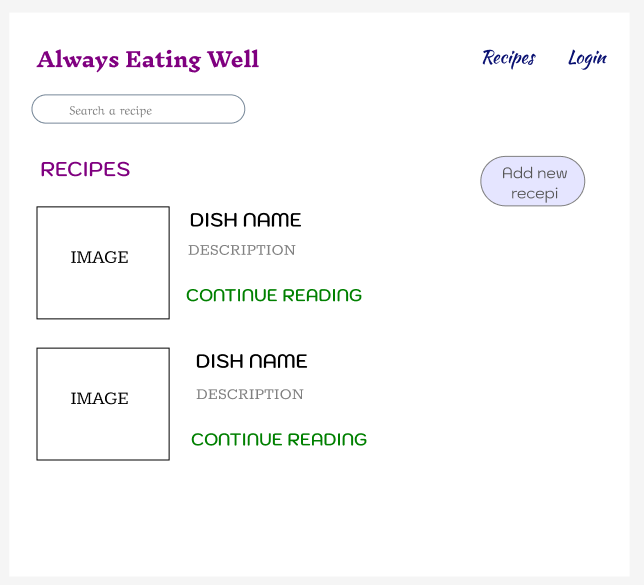
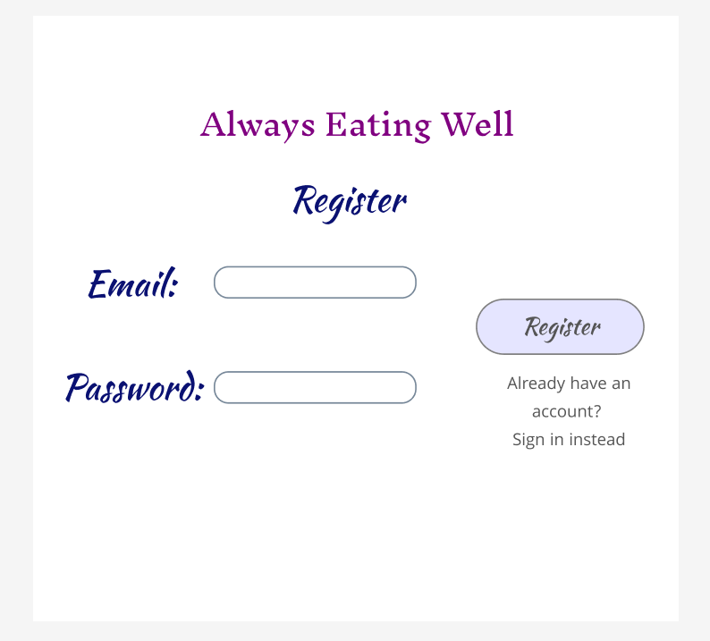
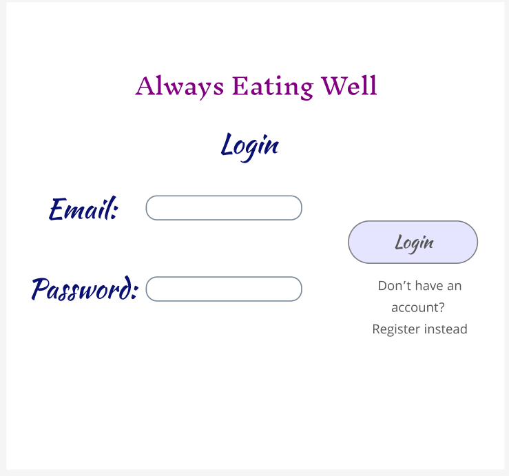
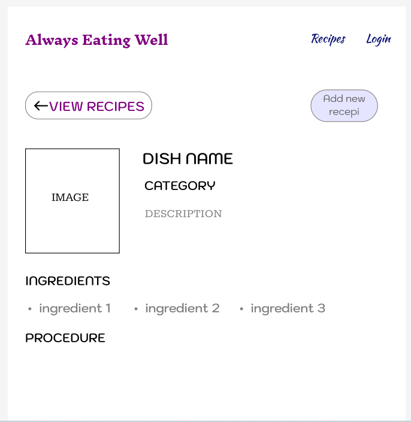

# Project Title

Always Eating Well

## Overview

Always Eating Well is a place for everyone to be able to cook good healthy recipes and always stay updated with new recipes

### Problem

Food is a basic daily need for everyone. Everyone needs to know how to cook in order to survive. Always Eating Well would be a good place where one can easily learn about new healthy recipes and would be able to cook easily. 

### User Profile

- All people:
   - looking to learn new healthy recipe
   - access to a variety of tasty healthy food 
   - a good way to have changes in diet and maintain a healthy lifestyle

### Features

- As a user, I want to have access to all recipes 
- As a user I want to have access to recipes by meal type such as - Breakfast, 
  Lunch, Dinner, Snacks, etc
- As a user, I want to have access to some recipes by categories such as - Quick
  and easy, vegetarian, soups, salads

## Implementation

### Tech Stack

- React
- MySQL
- Express
- Client libraries: 
    - react
    - react-router
    - axios
- Server libraries:
    - knex
    - express

### APIs

Data from API to be stored in MySQL. Might use the actual API or would be creating a json file to store data. Might also need additional API for recipes in category.
- https://www.themealdb.com/api.php


### Sitemap

- Home page
- List recepis


### Mockups

#### Home Page


#### Register Page


#### Login Page


#### View Recipe Page



### Data


### Endpoints

**GET /recipes**

- Get recipes

Response:
```
[
    {
        "id": 1,
        "name": "Simple Homemade Tomato Soup",
        "category": "soup",
        "ingredients": [
            "tomatoes", 
            "olive oil",
            "butter",
            "garlic",
            "carrots",
            "onions",
            "balsamic vinegar",
            "vegetable broth",
            "full-fat coconut milk or cream",
            "dried thyme",
            "red pepper flakes",
            "fresh basil leaves",
            "salt",
            "pepper"
        ],
        "description": "This tomato soup recipe is a cold weather staple in our house. It couldn’t be simpler to make, and the ingredients are largely pantry basics that I always keep on hand. But more importantly, this tomato soup is creamy, comforting, and full of rich flavor. The tomatoes make it tangy, balsamic vinegar adds sweetness, and red pepper flakes give it a warming kick of heat. You could serve it on its own, topped with a swirl of olive oil, black pepper, and fresh basil leaves…or you could pair it with a grilled cheese sandwich. If you’re craving cozy comfort food as much as I have been recently, I definitely vote for the latter.",
        "image": "image path",
        "procedure": "procedure in steps"
    },
    ...
]
```

**GET /recipe/:id**

- Get recipe by id

Parameters:
- id: recipe id as number

Response:
```
{
    "id": 1,
    "name": "Simple Homemade Tomato Soup",
    "category": "soup",
    "ingredients": [
        "tomatoes", 
        "olive oil",
        "butter",
        "garlic",
        "carrots",
        "onions",
        "balsamic vinegar",
        "vegetable broth",
        "full-fat coconut milk or cream",
        "dried thyme",
        "red pepper flakes",
        "fresh basil leaves",
        "salt",
        "pepper"
    ],
    "description": "This tomato soup recipe is a cold weather staple in our house. It couldn’t be simpler to make, and the ingredients are largely pantry basics that I always keep on hand. But more importantly, this tomato soup is creamy, comforting, and full of rich flavor. The tomatoes make it tangy, balsamic vinegar adds sweetness, and red pepper flakes give it a warming kick of heat. You could serve it on its own, topped with a swirl of olive oil, black pepper, and fresh basil leaves…or you could pair it with a grilled cheese sandwich. If you’re craving cozy comfort food as much as I have been recently, I definitely vote for the latter.",
    "image": "image path",
    "procedure": "procedure in steps"
}
```

**POST /recipe/add**

- User can add the recipe

Response:
```
{
    "id": 1,
    "name": "Simple Homemade Tomato Soup",
    "category": "soup",
    "ingredients": [
        "tomatoes", 
        "olive oil",
        "butter",
        "garlic",
        "carrots",
        "onions",
        "balsamic vinegar",
        "vegetable broth",
        "full-fat coconut milk or cream",
        "dried thyme",
        "red pepper flakes",
        "fresh basil leaves",
        "salt",
        "pepper"
    ],
    "description": "This tomato soup recipe is a cold weather staple in our house. It couldn’t be simpler to make, and the ingredients are largely pantry basics that I always keep on hand. But more importantly, this tomato soup is creamy, comforting, and full of rich flavor. The tomatoes make it tangy, balsamic vinegar adds sweetness, and red pepper flakes give it a warming kick of heat. You could serve it on its own, topped with a swirl of olive oil, black pepper, and fresh basil leaves…or you could pair it with a grilled cheese sandwich. If you’re craving cozy comfort food as much as I have been recently, I definitely vote for the latter.",
    "image": "image path",
    "procedure": "procedure in steps"
}
```

**POST /users/register**

- Add a user account

Parameters:

- email: User's email
- password: User's provided password

Response:
```
{
    "token": "seyJhbGciOiJIUzI1NiIsInR5cCI6IkpXVCJ9.eyJzdWIiOiIxMjM0NTY3ODkwIiwibmFtZSI6I..."
}
```

**POST /users/login**

- Login a user

Parameters:
- email: User's email
- password: User's provided password

Response:
```
{
    "token": "seyJhbGciOiJIUzI1NiIsInR5cCI6IkpXVCJ9.eyJzdWIiOiIxMjM0NTY3ODkwIiwibmFtZSI6I..."
}
```

### Auth

- JWT auth

## Roadmap

- Create client
    - react project with routes and boilerplate pages

- Create server
    - express project with routing

- Create migrations

- Gather 5-10 sample recipes 

- Create seeds with sample recipes data

- Feature: View recipe
    - Implement view recipe page
    - Create GET /recipe/:id 

- Feature: Home page
    - Implement view all recipes page
    - Create GET /recipes

- Feature: User Profile (Register/Login)

- Feature: Add a new recipe
    - Create POST /recipe/add


- Bug fixes

- DEMO DAY

## Nice-to-haves 

- Search any recipe/by a category
- Comment feature and rate a recipe
- Forgot password functionality
- Ability to update or delete a blog posting (a recipe)
